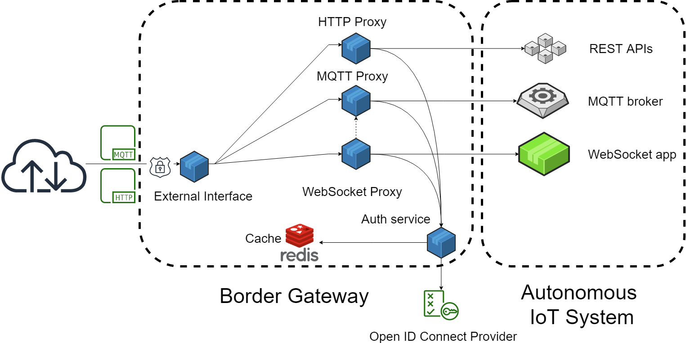

# Summary

The system architecture of an Internet of Things (IoT) application typically comprises
multiple devices, device gateways and services communicating through a variety of protocols. It is a
challenging task to ensure that remote access to any system component is only allowed
in case the communication is properly encrypted, authenticated, authorized and accounted for.
 
``Border Gateway`` offers a single entry point into a local IoT network using
an extensible micro services architecture implemented for Node.js. Currently the common protocols HTTP,
MQTT and WebSocket are supported. Border Gateway only allows TLS-encrypted connections, authenticates
each connection attempt against an OpenID Connect provider, performs a more fine-grained authorization
using a simple rule format and eventually forwards the request to the target service in the protected IoT
network.

The software has recently been deployed and improved in several Horizon 2020 research and innovation
projects funded by the European Union, notably MONICA (@monica), COMPOSITION (@composition) and Storage4Grid (@storage4grid).

# Figures

# Acknowledgements

The original prototype of Border Gateway was developed in a master thesis by Mohammad Alhareeqi advised
by Raphael Ahrens, José Ángel Carvajal Soto and Farshid Tavakolizadeh.

# References